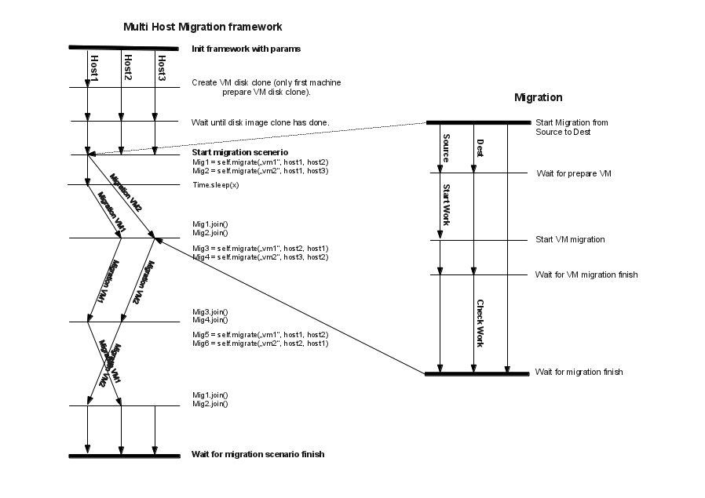

Writing your own QEMU multi host migration test
==============================================

Client part of Autotest works only on a single host, for this reason multi host
migration test needs to be started from the server part of Autotest. The server
module is responsible for preparing all hosts, then to start client part with
the appropriate parameters. To simplify writing a multi host migration, we
developed the MultihostMigration class. The class is a framework class that
allows to create, start and sync migration scenario over multiple host, taking
care of most of the heavy lifting for you.

Prepare env
-----------

For migration without disk migration is necessary have shared storage (NFS, ceph, etc.).
There have to be placed images of guests system in shared storage.
Nested virtualization config 
:doc:`Use nested virt to develop multi host tests <../advanced/VirtualEnvMultihost>`

Prepare config files
--------------------

Multi host migration uses almost all the configuration files from standard virt
tests. The only difference the main configuration file, named
``multi-host-tests.cfg``. All multi host migration tests are defined in
``client/virt/qemu/tests/cfg/multi-host.cfg``.

Start multi host migration tests
--------------------------------

The server part of Autotest, just as the client part, uses a control file to
describe the operations to be executed on a test job. The multi host migration
control file can be found at ``client/virt/qemu/multi_host.srv``.

Starting autoserv:

Change your current working directory to the root of the autotest repo, say
``/home/myuser/Code/autotest``:

::

    cd /home/myuser/Code/autotest
    server/autoserv -m 192.168.100.220,192.168.100.240 client/tests/virt/qemu/multi_host.srv

the command starts autotest on machine 192.168.100.220 and 192.168.100.240 and
uses them for multi_host.srv control file. If four machines are defined it'll
create two pairs and with each pair the independent migration test is started.
Because of it there is added new arg "all" in multi_host.srv. It starts
one migration test with all machines.

::

    server/autoserv -m 192.168.100.220,192.168.100.240,192.168.100.221 -a all client/virt/qemu/multi_host.srv

.. _multihost_migration:

Using of MultihostMigration class
---------------------------------

Scheme:
~~~~~~~

:download:`Source file for the diagram above (LibreOffice file) <MultiHostMigration/multihost-migration.odg>`

Example:
~~~~~~~~

::

    class TestMultihostMigration(virt_utils.MultihostMigration):
        def __init__(self, test, params, env):
            super(testMultihostMigration, self).__init__(test, params, env)

        def migration_scenario(self):
            srchost = self.params.get("hosts")[0]
            dsthost = self.params.get("hosts")[1]

            def worker(mig_data):
                vm = env.get_vm("vm1")
                session = vm.wait_for_login(timeout=self.login_timeout)
                session.sendline("nohup dd if=/dev/zero of=/dev/null &")
                session.cmd("killall -0 dd")

            def check_worker(mig_data):
                vm = env.get_vm("vm1")
                session = vm.wait_for_login(timeout=self.login_timeout)
                session.cmd("killall -9 dd")

            # Almost synchronized migration, waiting to end it.
            # Work is started only on first VM.

            self.migrate_wait(["vm1", "vm2"], srchost, dsthost,
                              worker, check_worker)

            # Migration started in different threads.
            # It allows to start multiple migrations simultaneously.

            # Starts one migration without synchronization with work.
            mig1 = self.migrate(["vm1"], srchost, dsthost,
                                worker, check_worker)

            time.sleep(20)

            # Starts another test simultaneously.
            mig2 = self.migrate(["vm2"], srchost, dsthost)
            # Wait for mig2 finish.
            mig2.join()
            mig1.join()

    mig = TestMultihostMigration(test, params, env)
    # Start test.
    mig.run()

When you call:

::

    mig = TestMultihostMigration(test, params, env):

What happens is

1. VM's disks will be prepared.
2. The synchronization server will be started.
3. All hosts will be synchronized after VM create disks.

When you call the method:

::

    migrate():

What happens in a diagram is:

+------------------------------------------+-----------------------------------+
|                source                    |             destination           |
+==========================================+===================================+
|                  It prepare VM if machine is not started.                    |
+------------------------------------------+-----------------------------------+
|            Start work on VM.             |                                   |
+------------------------------------------+-----------------------------------+
|          ``mig.migrate_vms_src()``       |   ``mig.migrate_vms_dest()``      |
+------------------------------------------+-----------------------------------+
|                                          | Check work on VM after migration. |
+------------------------------------------+-----------------------------------+
|                       Wait for finish migration on all hosts.                |
+------------------------------------------+-----------------------------------+

It's important to note that the migrations are made using the ``tcp`` protocol,
since the others don't support multi host migration.

::

    def migrate_vms_src(self, mig_data):
        vm = mig_data.vms[0]
        logging.info("Start migrating now...")
        vm.migrate(mig_data.dst, mig_data.vm_ports)

This example migrates only the first machine defined in migration. Better example
is in ``virt_utils.MultihostMigration.migrate_vms_src``. This function migrates
all machines defined for migration.
