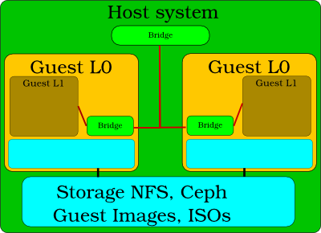

================================================
Setup a virtual environment for multi host tests
================================================

Problem:
--------

For multi-host tests multiple physical systems are often required. It is possible to use
two virtual guests for most of autotest tests except for virt-tests
(kvm, libvirt, ...).

However, It is possible to use Nested Virtualization to serve as first level (L0)
guests and run nested guests inside them.

This page explains, how to setup (Fedora/RHEL) and use single computer with
nested virtualization for such cases. Be careful that nested virtualization
works usually right, but there are cases where it might lead to hidden problems.
Do not use nested virtualization for production testing.

Nested Virtualization:
----------------------

1. **Emulated:**
    * **qemu** very slow

2. **hardware accelerated:**
    * **Hardware for the accelerated nested virtualization**

          AMD Phenom and never            core extension (smv, NPT)
          Intel Nehalem and never         core extension (vmx, EPT)
    * **Software which supports the accelerated nested virtualization**

          kvm, xen, vmware, ....
          almost the same speed like native guest (1.0-0.1 of native quest performance). Performance
          depends on the type of load. IO load could be quite slow. Without vt-d or AMD-Vi and network
          device pass through.

.. _nested_virt:

Configuration for multi-host virt tests:
----------------------------------------

### Config of host system

* Intel CPU

    `options kvm_intel nested=1` to the end of some modules config file /etc/modprobe.d/modules.conf

* AMD CPU

    `options kvm_amd nested=1` to the end of some modules config file /etc/modprobe.d/modules.conf

### Config of Guest L0

* Intel CPU
    *  **Virtual manager**
        `Procesor config->CPU Features->vmx set to require`
    *  **Native qemu-kvm**
        `qemu-kvm -cpu core2duo,+vmx -enable-kvm .....`

* AMD CPU
    *  **Virtual manager**
        `Procesor config->CPU Features->svm set to require`
    *  **Native qemu-kvm**
        `qemu-kvm -cpu qemu64,+svm -enable-kvm .....`

### Config of Guest L0 System
Connect to host bridge with guest L0 bridge without DHCP (dhcp collision with host system dhcp).

1. Destroy libvirt bridge which contain dhcp.
2. Enable network service systemctl enable network.service
3. Add new bridge `virbr0` manually and insert to them L0 network adapter `eth0` which is connected to host bridge

::

        #interface connected to host system bridge
        vi /etc/sysconfig/network-scripts/ifcfg-eth0
             NM_CONTROLLED="no"
             DEVICE="eth0"
             ONBOOT="yes"
             BRIDGE=virbr0

        #Bridge has name virbr0 for compatibility with standard autotest settings.
        vi /etc/sysconfig/network-scripts/ifcfg-virbr0
            DHCP_HOSTNAME="atest-guest"
            NM_CONTROLLED="no"
            BOOTPROTO="dhcp"
            ONBOOT="yes"
            IPV6INIT="no"
            DEVICE=virbr0
            TYPE=Bridge
            DELAY=0

and for sure disable NetworkManager `systemctl disable NetworkManager.service`

### Check Guest L0 System

`modprobe kvm-intel` or `modprobe kvm-amd` should work

Start for multi-host virt tests:
--------------------------------
### Manually from host machine

    cd autotest/client/tests/virt/qemu/
    sudo rm -rf results.*; sudo ../../../../server/autoserv -m guestL0_1,guestL0_2 multi_host.srv

### From autotest gui

1. Start autotest frontend RPC or WEB interface https://github.com/autotest/autotest/wiki/SysAdmin
2. Select multi_host test from pull-request https://github.com/autotest/autotest-server-tests/pull/1

More details:
-------------

Set up/configuration, the root directory (of this git repo) also has simple scripts to create L1 and L2 guests. And reference of L1, L2 libvirt files are also added -- https://github.com/kashyapc/nvmx-haswell/blob/master/SETUP-nVMX.rst